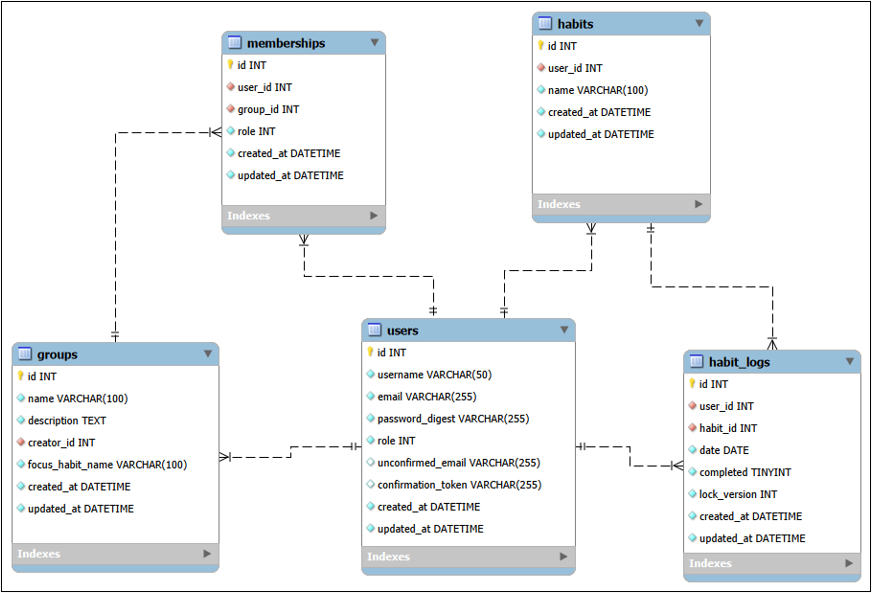
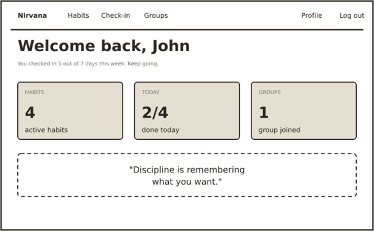
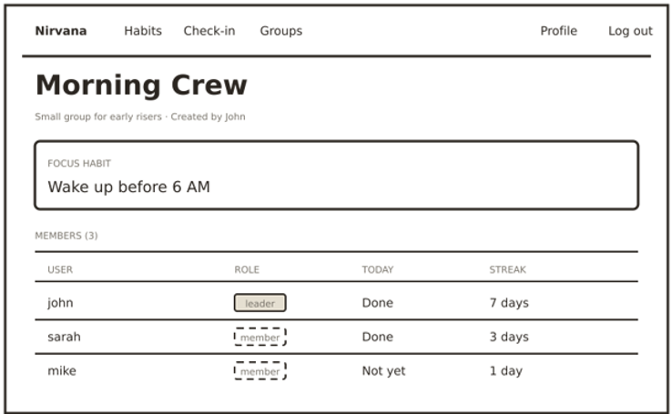
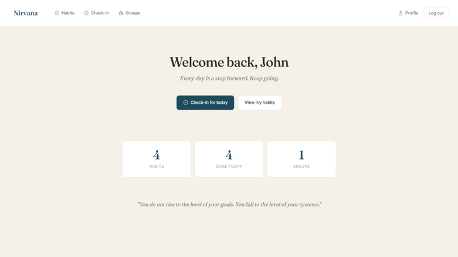
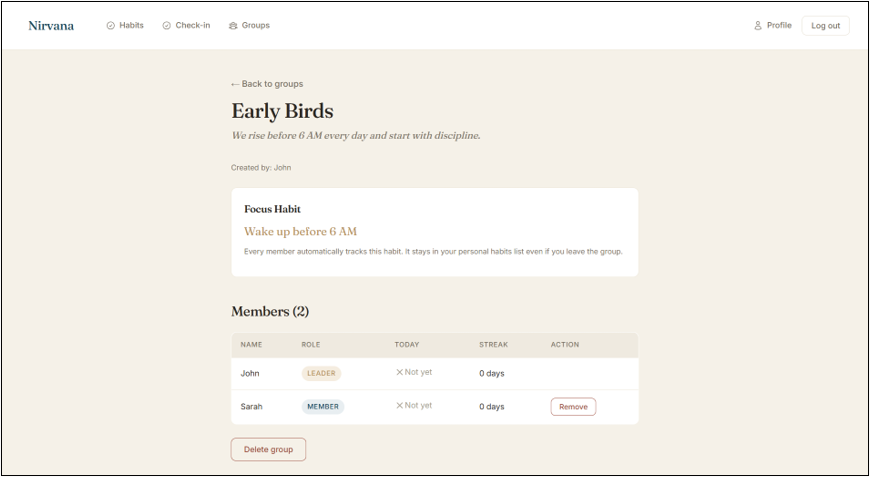
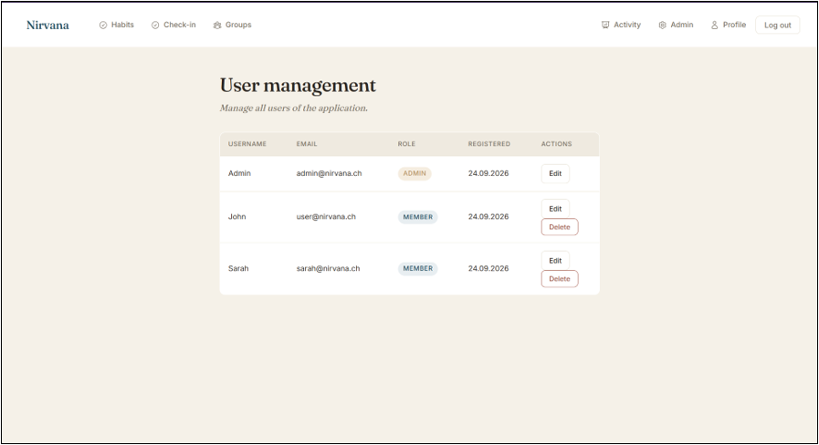

# Nirvana – Comeback-Tracker für Disziplin

**Projektdokumentation Modul 223 – Multi-User-Applikationen objektorientiert realisieren**

| | |
|---|---|
| **Autor** | John Kothalawalage Deshan |
| **Modul** | Modul 223 – Multi-User-Applikationen |
| **Kursnummer** | 24-223-F |
| **Datum** | 24.09.2026 |
| **Schule** | BBZ-BL Basel |

> Die vollständige, formatierte Version dieser Dokumentation liegt als PDF in der Moodle-Abgabe. Dieses Dokument enthält die wichtigsten Inhalte in Markdown-Form.

---

## Inhaltsverzeichnis

1. [Problemstellung](#problemstellung)
2. [Projekt](#projekt)
3. [Anforderungsanalyse](#anforderungsanalyse)
4. [ERM](#erm-entity-relationship-model)
5. [Wireframes](#wireframes)
6. [Verwendete Technologien](#verwendete-technologien)
7. [Klassen und Struktur](#klassen-und-struktur)
8. [Sicherheits-Features](#sicherheits-features)
9. [Locking und Transaktionen](#locking-und-transaktionen)
10. [Screenshots der Implementierung](#screenshots-der-implementierung)
11. [Startanleitung](#startanleitung)
12. [Erreichter Stand](#erreichter-stand)
13. [Learnings und Ausblick](#learnings-und-ausblick)

---

## Problemstellung

Viele junge Menschen kämpfen damit, nach einer Phase der Unproduktivität wieder zurück zu einer disziplinierten Routine zu finden. Es fehlt an Struktur, Verbindlichkeit und Motivation, tägliche Gewohnheiten wie frühes Aufstehen, Meditation, Sport und Lernen konsequent durchzuziehen. Alleine fällt es schwer, dranzubleiben – ohne Feedback und ohne jemanden, der mitzieht, verlieren viele schnell den Antrieb.

---

## Projekt

- **Domäne:** Self-Improvement und Produktivität
- **Name der Applikation:** Nirvana
- **Vision:** Nirvana unterstützt Menschen auf ihrem Comeback-Weg. Die App ermöglicht es, eigene Gewohnheiten täglich einzuchecken, den Fortschritt über Streaks sichtbar zu machen und sich in Accountability-Gruppen mit einem gemeinsamen Focus-Habit gegenseitig zu motivieren.

### Projektplanung: 1. MVP Iteration

Die wichtigste funktionale Anforderung für die erste Iteration ist das tägliche Check-in-System mit Streak-Tracking und die Möglichkeit, Accountability-Gruppen mit einem gemeinsamen Focus-Habit zu bilden. Wenn ein Benutzer einer Gruppe beitritt, wird ihm der Focus-Habit automatisch in seiner persönlichen Habit-Liste angelegt.

---

## Anforderungsanalyse

### Funktionale Anforderungen (priorisiert)

1. Benutzer können sich registrieren und einloggen
2. Benutzer können eigene Gewohnheiten (Habits) erstellen, ansehen und löschen
3. Benutzer können täglich pro Habit einchecken (Toggle erledigt / nicht erledigt)
4. Benutzer sehen ihre aktuelle Streak pro Habit und die 7-Tage-Historie
5. Benutzer können Accountability-Gruppen mit einem Focus-Habit erstellen
6. Benutzer können Gruppen beitreten – der Focus-Habit wird automatisch in die eigene Habit-Liste übernommen
7. Gruppenleiter können Mitglieder entfernen und die Gruppe löschen
8. Gruppenmitglieder sehen im Gruppen-Dashboard pro Mitglied: Rolle, Today-Status, Streak
9. Benutzer können ihr Profil bearbeiten (Username, E-Mail mit Bestätigung, Passwort)
10. Administratoren können alle Benutzer und Gruppen verwalten
11. Alle Änderungen werden im Aktivitätsprotokoll aufgezeichnet

### Qualitätsattribute (nicht-funktionale Anforderungen)

1. **Benutzerfreundlichkeit** – Tägliches Einchecken in unter 30 Sekunden. Klare Flash-Meldungen. Bestätigungsdialoge nur bei kritischen Aktionen.
2. **Sicherheit** – Passwörter mit bcrypt gehasht, mindestens 12 Zeichen. Login über `authenticate_by` mit Schutz vor Timing-Angriffen. CSRF-Schutz auf allen Formularen.
3. **Datenkonsistenz** – Keine doppelten Check-ins pro Tag möglich (Unique-Index auf user_id + habit_id + date). Optimistic Locking auf HabitLogs.
4. **Nachvollziehbarkeit** – PaperTrail zeichnet alle Änderungen an Habits, HabitLogs und Groups automatisch auf – mit User-ID und Zeitstempel.

### Benutzerrollen

Nirvana hat **zwei Ebenen** von Rollen:

**System-Ebene (globale Rolle pro User):**
- **Admin** – Kann alle Benutzer einsehen, deren Rollen ändern (ausser eigene), User löschen (ausser sich selbst), jede Gruppe löschen und das Aktivitätsprotokoll einsehen.
- **Member** – Standard-Rolle nach der Registrierung. Nutzt die App normal.

**Gruppen-Ebene (pro Membership):**
- **Leader** – Wer eine Gruppe erstellt, wird automatisch Leader. Kann Mitglieder entfernen.
- **Member (Gruppe)** – Normales Gruppenmitglied. Kann jederzeit die Gruppe verlassen.

Ein User kann in einer Gruppe Leader sein und in einer anderen Gruppe normales Mitglied – die Gruppen-Rolle gilt nur pro einzelner Mitgliedschaft.

---

## ERM (Entity-Relationship-Model)



**Tabellen im Überblick:**

| Tabelle | Zweck |
|---|---|
| users | Benutzer mit Login-Daten und Systemrolle |
| habits | Gewohnheiten pro User |
| habit_logs | Tägliche Check-ins (mit lock_version für Optimistic Locking) |
| groups | Accountability-Gruppen mit Focus-Habit |
| memberships | Zuordnung User zu Gruppe (leader/member) |
| versions | Aktivitätsprotokoll (PaperTrail, automatisch) |

**Hinweis:** MySQL Workbench zeigt INT und TINYINT. In der tatsächlichen SQLite-Datenbank werden INTEGER und BOOLEAN verwendet – die logische Struktur ist identisch.

---

## Wireframes

Die Wireframes wurden im Fat-Marker-Stil erstellt – ohne Farbe und ohne Details, um den Fokus auf Anordnung und Navigation zu legen.

### Home / Dashboard



### Gruppen-Detail mit Focus-Habit



---

## Verwendete Technologien

Technologie-Stack mit Versionen. Für Details zu Ruby und Rails siehe [Rails Guides](https://guides.rubyonrails.org/) und [Ruby Docs](https://ruby-doc.org/).

| Technologie | Version |
|---|---|
| Ruby | 4.0.6 |
| Ruby on Rails | 8.1.3.1 |
| SQLite | 3.x |
| Bundler | 2.5.x |
| Node.js (Importmap) | 20.x |

**Wichtigste Gems:**

| Gem | Zweck |
|---|---|
| bcrypt | Passwort-Hashing (has_secure_password) |
| pundit | Autorisierung mit Policy-Klassen |
| paper_trail | Aktivitätsprotokoll (Audit-Log) |
| sqlite3 | Datei-basierte Datenbank |
| importmap-rails | JavaScript ohne Build-Prozess |
| propshaft | Asset Pipeline |

---

## Klassen und Struktur

Die Anwendung folgt der klassischen Rails-MVC-Struktur.

### Models (`app/models/`)

- **User** – has_secure_password, Enum role (member/admin), Validierungen
- **Habit** – Gehört zu User, hat viele HabitLogs
- **HabitLog** – Enthält date, completed, lock_version (Optimistic Locking)
- **Group** – Enthält focus_habit_name, hat viele Memberships
- **Membership** – Verbindung User zu Group mit Rolle (leader/member)

### Controllers (`app/controllers/`)

- **SessionsController** – Login/Logout mit `authenticate_by`
- **RegistrationsController** – Registrierung neuer User
- **ProfilesController** – Profil, E-Mail-Bestätigung, Passwort-Änderung
- **HabitsController** – Habits verwalten, Streak-Berechnung
- **HabitLogsController** – Tägliche Check-ins toggeln
- **GroupsController** – Gruppen verwalten
- **MembershipsController** – Beitritt/Austritt aus Gruppen
- **Admin::UsersController** – Admin-Bereich für User-Verwaltung
- **ActivitiesController** – Aktivitätsprotokoll (nur Admin)

### Policies (`app/policies/`)

Für jedes Model existiert eine Pundit-Policy-Klasse: `UserPolicy`, `GroupPolicy`, `HabitPolicy`, `MembershipPolicy`, `ActivityPolicy`. Berechtigungen werden zentral in den Policies verwaltet, Controller rufen nur `authorize @record` auf.

---

## Sicherheits-Features

### Authentifizierung mit authenticate_by

Rails 8 Methode mit Schutz vor Timing-Angriffen. Der Vergleich der Passwort-Hashes dauert immer gleich lange, unabhängig davon ob der User existiert oder nicht.

### Passwort-Anforderungen

- Mindestens 12 Zeichen
- Mit bcrypt gehasht – nie Klartext gespeichert
- Aktuelles Passwort nötig bei Änderung

### CSRF-Schutz

Rails aktiviert standardmässig CSRF-Schutz. Jedes Formular enthält automatisch ein `authenticity_token`. Ohne Token werden POST/PUT/DELETE-Anfragen mit 422 abgelehnt.

### Schutz gegen SQL-Injection

ActiveRecord verwendet Prepared Statements. Immer parametrisiert (z.B. `User.where(email: params[:email])`).

### PaperTrail Aktivitätsprotokoll

Auf Habit, HabitLog und Group aktiviert. Jede Änderung wird mit whodunnit und Zeitstempel protokolliert.

---

## Locking und Transaktionen

### Transaktionen

- **Gruppen-Erstellung:** Gruppe + Leader-Membership + Focus-Habit werden in einer Transaktion angelegt. Fehlschlag = alles zurückgerollt.
- **Gruppen-Beitritt:** Membership + Auto-Focus-Habit in einer Transaktion.
- **E-Mail-Änderung:** Neue E-Mail als `unconfirmed_email` + `confirmation_token` in Transaktion gespeichert. Aktivierung erst nach Klick auf Bestätigungslink.

### Optimistic Locking

Die `habit_logs`-Tabelle hat eine Spalte `lock_version`. Rails erhöht diesen Zähler bei jedem Update. Wenn zwei parallele Requests denselben Log ändern, erkennt Rails am veralteten Zähler den Konflikt und wirft `ActiveRecord::StaleObjectError` – der zweite Update wird abgelehnt.

### Weitere Datenkonsistenz-Sicherungen

- **Unique-Index** auf `(user_id, habit_id, date)` verhindert doppelte Check-ins am selben Tag
- **Unique-Index** auf `(user_id, group_id)` verhindert doppelten Gruppenbeitritt
- **Unique-Index** auf `users.email` verhindert doppelte Registrierungen

---

## Screenshots der Implementierung

### Dashboard nach Login



Personalisierter Willkommens-Screen mit Stats-Cards (Habits, heute erledigt, Gruppen) und Motivations-Zitat.

### Gruppen-Detail mit Focus-Habit



Zeigt den Focus-Habit als Card und die Members-Tabelle mit Rolle, Today-Status (Done / Not yet) und Streak.

### Admin User-Management



Tabelle mit allen Usern. Rolle als Badge. Edit- und Delete-Button pro User (ausser bei sich selbst).

---

## Startanleitung

Vollständige Anleitung siehe [`../README.md`](../README.md).

### Kurzform

```bash
cd nirvana
chmod +x bin/*
bundle install
bin/rails db:setup
bin/rails server
```

App läuft auf http://localhost:3000

### Test-Logins

| Rolle | Email | Passwort |
|---|---|---|
| Admin | admin@nirvana.ch | Admin12345678 |
| Member | user@nirvana.ch | User12345678 |
| Member | sarah@nirvana.ch | Sarah12345678 |

---

## Erreichter Stand

Alle im MVP definierten Anforderungen wurden umgesetzt.

| Kriterium | Status |
|---|---|
| Authentifizierung (has_secure_password, 12 Zeichen, Timing-Schutz) | erfüllt |
| Rollen (Admin/Member System + Leader/Member Gruppen) | erfüllt |
| Benutzerprofil (Show, Edit, Passwort, E-Mail-Bestätigung) | erfüllt |
| Benutzerverwaltung (Admin-Bereich) | erfüllt |
| Transaktionen (Gruppen-Erstellung, Beitritt, E-Mail) | erfüllt |
| Optimistic Locking (HabitLog) | erfüllt |
| Aktivitätsprotokoll (PaperTrail) | erfüllt |
| Fehlerbehandlung und User-Feedback | erfüllt |
| Automatisierte Tests (17 grüne Tests) | erfüllt |
| Kernfunktion Habits + Check-in + Gruppen mit Focus-Habit | erfüllt |

### Bewusste Design-Entscheidungen

- **Habits sind nicht editierbar** – nur löschen. Grund: Streak-Integrität. Ein Umbenennen würde die Historie verfälschen.
- **Focus-Habit bleibt bei Gruppen-Austritt bestehen** – User-Freiheit, sich weiterhin auf den Habit zu fokussieren.
- **Kein Cronjob für Check-in-Reset** – Check-ins sind datumsgebunden. Rails sucht immer nach dem aktuellen Datum, ein Reset ist nicht nötig.
- **Admin kann eigene Rolle nicht ändern** – Schutz gegen versehentlichen Self-Lockout.

---

## Learnings und Ausblick

### Learnings

- **Pundit-Policies** zwingen zu sauberer Trennung von Berechtigungslogik
- **Optimistic Locking** mit `lock_version` löst Race Conditions elegant
- **Focus-Habit-Konzept**: Eine kleine Idee macht die Gruppen viel wertvoller

### Ausblick

- Echter Mailer statt Konsolen-Logging für Bestätigungs-E-Mails
- Gruppen-Challenges mit Zeitrahmen
- Reactions auf Check-ins
- Statistiken über Wochen und Monate
- Deployment auf echten Server

---

## Referenzen

- [Rails Guides](https://guides.rubyonrails.org/)
- [Pundit Documentation](https://github.com/varvet/pundit)
- [PaperTrail Documentation](https://github.com/paper-trail-gem/paper_trail)
- [Public GitHub Repo](https://github.com/Djohn618/nirvana)
